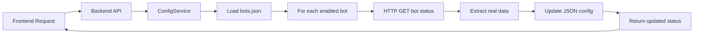

# 🤖 Bot Manager

**A modern, configuration-driven bot management system** that provides real-time monitoring, automatic data synchronization, and centralized control for Discord and WhatsApp bots.

## 🌟 Overview

Bot Manager is a full-stack TypeScript application that transforms bot management from hardcoded configurations to a dynamic, scalable system. It features a Next.js frontend dashboard and a Node.js backend API that automatically synchronizes with live bot instances, providing real-time status updates and centralized management capabilities.

### ✨ Key Features

- 🔄 **Auto-Sync Technology**: Automatically fetches and syncs real data from bot instances
- 📊 **Real-Time Monitoring**: Live status tracking with intelligent health checks
- 🎛️ **Centralized Configuration**: JSON-based bot management with hot-reload capability
- 🌐 **Multi-Platform Support**: WhatsApp and Discord bot integration
- 🔌 **Direct API Access**: Frontend can communicate directly with individual bots
- 📱 **Modern UI Dashboard**: Responsive interface with QR code access for WhatsApp bots
- 🚀 **CRUD Operations**: Complete bot lifecycle management via REST API

## 🏗️ Architecture

```
┌─────────────────┐    HTTP/REST     ┌──────────────────┐
│   Frontend      │ ◄──────────────► │    Backend       │
│   (Port 7261)   │                  │   (Port 3001)    │
│                 │                  │                  │
│ • Dashboard     │                  │ • ConfigService  │
│ • Bot Cards     │                  │ • BotService     │
│ • QR Viewer     │                  │ • Auto-Sync      │
└─────────────────┘                  └──────────────────┘
                                               │
                                               │ Reads/Writes
                                               ▼
                                     ┌──────────────────┐
                                     │  config/bots.json│
                                     │                  │
                                     │ • Bot configs    │
                                     │ • Real-time data │
                                     │ • Auto-updated   │
                                     └──────────────────┘
                                               │
                                               │ HTTP Status Checks
                                               ▼
                              ┌─────────────────────────────────────┐
                              │         Live Bot Instances          │
                              │                                     │
                              │ • WhatsApp Bots (7260, 7262)      │
                              │ • Discord Bots (8080)              │
                              │ • Real-time status & data          │
                              └─────────────────────────────────────┘
```

## 📂 Project Structure

```
bot-manager/
├── 📁 backend/                    # Node.js TypeScript API Server
│   ├── src/
│   │   ├── services/
│   │   │   ├── configService.ts   # 🆕 Singleton config management
│   │   │   ├── botService.ts      # 🔄 Auto-sync bot monitoring
│   │   │   └── whatsappService.ts # WhatsApp specific logic
│   │   ├── controllers/           # REST API controllers
│   │   ├── routes/               # API route definitions
│   │   ├── types/                # TypeScript interfaces
│   │   └── app.ts                # Server entry point
│   ├── package.json              # Dependencies & scripts
│   └── tsconfig.json             # TypeScript config
├── 📁 frontend/                   # Next.js 15 App Router
│   ├── app/                      # App router pages
│   ├── components/
│   │   ├── bot-card.tsx          # 🔄 Enhanced bot display
│   │   ├── bot-dashboard.tsx     # 🔄 Main dashboard
│   │   └── ui/                   # Shadcn/ui components
│   ├── lib/
│   │   ├── api.ts                # 🆕 API helpers & bot communication
│   │   ├── types.ts              # Shared TypeScript types
│   │   └── utils.ts              # Utility functions
│   └── package.json              # Frontend dependencies
├── 📁 config/
│   └── bots.json                 # 🆕 Dynamic bot configuration
├── 📋 MIGRATION_GUIDE.md          # 🆕 Comprehensive migration docs
├── 📋 DEVELOPMENT.md              # Development setup guide
├── 🔧 .gitignore                 # 🆕 Proper node_modules exclusion
├── 🔧 package.json               # Root monorepo config
└── 📋 README.md                  # This file
```

**Legend:** 🆕 New • 🔄 Refactored • 📁 Directory • 📋 Documentation • 🔧 Configuration

## 🚀 Features

### 🔧 Backend Capabilities

- **🔄 ConfigService (Singleton)**: Centralized configuration management with auto-save
- **📊 BotService**: Intelligent status monitoring with multi-format response support
- **🔌 Auto-Synchronization**: Real-time data extraction from live bot instances
- **🛡️ Error Handling**: Robust connection failure management with detailed logging
- **🔍 Health Checks**: Smart bot detection using multiple status criteria
- **📝 CRUD API**: Complete bot lifecycle management via REST endpoints
- **🎯 Fallback Configuration**: Default API hosts for flexible deployment

### 🎨 Frontend Dashboard

- **📱 Responsive UI**: Modern interface built with Next.js 15 and Shadcn/ui
- **🤖 Bot Cards**: Live status display with real-time data synchronization
- **📊 Status Indicators**: Visual health monitoring with uptime information
- **📷 QR Code Access**: Direct WhatsApp QR code viewing for easy setup
- **🔧 Management Interface**: Add, edit, and delete bots through the UI
- **🔄 Real-time Updates**: Automatic refresh of bot status and information

### 🌐 Multi-Platform Support

- **💬 WhatsApp Bots**: Full integration with phone number and push name sync
- **🎮 Discord Bots**: Complete Discord bot monitoring and management
- **🔌 Direct Communication**: Frontend can access individual bot APIs directly
- **📡 Status Monitoring**: Platform-specific health checks and status reporting

## ⚙️ Configuration

### 📁 Bot Configuration (`config/bots.json`)

The system uses a dynamic JSON configuration file that automatically updates with real bot data:

```json
{
  "bots": [
    {
      "id": "whatsapp-bot-container-amp",
      "name": "Container AMP",
      "type": "whatsapp",
      "pm2ServiceId": "wabot-7262",
      "apiHost": "http://20.121.40.254",
      "apiPort": 7262,
      "phoneNumber": "18296459554", // ← Auto-synced from bot
      "pushName": "AM", // ← Auto-synced from bot
      "enabled": true,
      "createdAt": "2025-06-11T14:21:59.712Z",
      "updatedAt": "2025-06-11T17:35:52.771Z" // ← Auto-updated
    }
  ]
}
```

### 🔧 Configuration Fields

| Field          | Type                      | Description              | Auto-Sync |
| -------------- | ------------------------- | ------------------------ | --------- |
| `id`           | string                    | Unique bot identifier    | ❌        |
| `name`         | string                    | Display name for the bot | ❌        |
| `type`         | `'whatsapp' \| 'discord'` | Bot platform type        | ❌        |
| `pm2ServiceId` | string                    | PM2 process identifier   | ❌        |
| `apiHost`      | string                    | Bot API host URL         | ❌        |
| `apiPort`      | number                    | Bot API port number      | ❌        |
| `phoneNumber`  | string \| null            | WhatsApp phone number    | ✅        |
| `pushName`     | string \| null            | WhatsApp display name    | ✅        |
| `enabled`      | boolean                   | Whether bot is active    | ❌        |
| `createdAt`    | string                    | Creation timestamp       | ❌        |
| `updatedAt`    | string                    | Last modification time   | ✅        |

### 🌍 Environment Variables

**Backend (.env):**

```bash
PORT=3001                          # Backend server port
FALLBACK_API_HOST=http://localhost # Default host for empty apiHost values
```

**Frontend (.env.local):**

```bash
NEXT_PUBLIC_API_BASE_URL=http://localhost:3001  # Backend API endpoint
```

### 🔌 Port Configuration

| Service          | Port              | Purpose                    |
| ---------------- | ----------------- | -------------------------- |
| **Backend API**  | `3001`            | Main API server            |
| **Frontend Web** | `7261`            | Next.js development server |
| **Bot Services** | `7260-7262, 8080` | Individual bot instances   |

## 🚀 Quick Start

### 1. Environment Setup

Copy the root environment files and configure them for your setup:

```bash
# Copy environment templates
cp .env.example .env
cp .env.example .env.production

# Edit the files with your configuration
nano .env
```

### 2. Bot Configuration

Create your bot configuration file:

```bash
# Copy the example bot configuration
cp config/bots.json.example config/bots.json

# Edit with your actual bot instances
nano config/bots.json
```

**Bot Configuration Format:**

```json
{
  "bots": [
    {
      "id": "unique-bot-id",
      "name": "Bot Display Name",
      "type": "whatsapp", // or "discord"
      "pm2ServiceId": "wabot-7001", // PM2 service name (wabot-{port})
      "isExternal": false, // true for remote bots, false for local PM2-managed
      "apiHost": "http://localhost", // or remote server URL
      "apiPort": 7001,
      "phoneNumber": "+1234567890", // WhatsApp only
      "pushName": "Bot Name", // WhatsApp display name
      "enabled": true,
      "createdAt": "2025-01-01T00:00:00.000Z",
      "updatedAt": "2025-01-01T00:00:00.000Z"
    }
  ]
}
```

**Bot Types:**

- **External Bots** (`isExternal: true`): Running on remote servers, API-only monitoring
- **Internal Bots** (`isExternal: false`): Managed by local PM2, full process monitoring

### 3. Installation & Development

```bash
# Install dependencies
npm install

# Start development servers (both frontend and backend)
npm run dev

# Or start individually
npm run dev:frontend  # Port 7261
npm run dev:backend   # Port 3001
```

### 4. Production Deployment

```bash
# Build for production
npm run build

# Start production servers
npm run start:backend
npm run start:frontend
```

### 🧪 Verify Installation

```bash
# Check backend health
curl http://localhost:3001/api/bots

# Check frontend
open http://localhost:7261

# Test direct bot communication (if bots are running)
curl http://20.121.40.254:7262/status
```

## 🌐 API Reference

### 📊 Backend Endpoints (Port 3001)

#### 🤖 Bot Management

```bash
GET    /api/bots              # List all bots with real-time status
GET    /api/bots/:id          # Get specific bot details
POST   /api/bots              # Create new bot configuration
PUT    /api/bots/:id          # Update existing bot
DELETE /api/bots/:id          # Remove bot configuration
```

#### 📈 Status Monitoring

```bash
GET    /api/status/:id        # Get specific bot status
GET    /api/status/whatsapp   # Get all WhatsApp bot statuses
GET    /api/status/discord    # Get all Discord bot statuses
```

#### 💬 Messaging

```bash
POST   /api/bots/:id/send     # Send message via specific bot
```

### 🔌 Frontend API Helpers

The frontend provides helper functions for easy API access:

```typescript
import { api, botApi } from "@/lib/api";

// Backend API calls
const bots = await fetch(api.getBots());
const status = await fetch(api.getBotStatus("bot-id"));

// Direct bot communication
const qrCode = botApi.getWhatsAppQR(bot); // Get QR code URL
const status = botApi.getWhatsAppStatus(bot); // Direct status check
```

### 📝 Example API Responses

**GET /api/bots:**

```json
[
  {
    "id": "whatsapp-bot-container-amp",
    "name": "Container AMP",
    "type": "whatsapp",
    "status": "online",
    "phoneNumber": "18296459554",
    "pushName": "AM",
    "uptime": "9603 seconds",
    "lastChecked": "2025-06-11T17:35:52.771Z"
  }
]
```

**GET /api/status/whatsapp:**

```json
[
  {
    "id": "whatsapp-bot-container-amp",
    "name": "Container AMP",
    "status": "online",
    "phoneNumber": "18296459554",
    "pushName": "AM",
    "uptime": "9603 seconds",
    "lastChecked": "2025-06-11T17:35:52.771Z"
  }
]
```

## 🔄 How Auto-Sync Works

The system automatically synchronizes with live bot instances to keep configuration data current:



### 🎯 Sync Process Details

1. **Status Check Trigger**: Frontend requests bot status
2. **Configuration Load**: Backend loads current config from JSON
3. **Health Check**: Makes HTTP requests to each bot's status endpoint
4. **Data Extraction**: Parses response for phone numbers, push names, etc.
5. **Auto-Update**: Writes real data back to JSON configuration
6. **Response**: Returns updated status with real-time data

### 🔍 Intelligent Status Detection

The system supports multiple response formats from different bot implementations:

```typescript
// Detects online status using multiple criteria
const isOnline =
  response.data.connected === true || response.data.status === "online";

// Extracts real data regardless of response format
const phoneNumber =
  response.data.client?.wid?.user ||
  response.data.phoneNumber ||
  bot.phoneNumber;
```

## 🛠️ Development

### 🎯 Adding a New Bot

1. **Via API (Recommended):**

   ```bash
   curl -X POST http://localhost:3001/api/bots \
     -H "Content-Type: application/json" \
     -d '{
       "name": "New WhatsApp Bot",
       "type": "whatsapp",
       "pm2ServiceId": "new-bot",
       "apiHost": "http://20.121.40.254",
       "apiPort": 7263,
       "enabled": true
     }'
   ```

2. **Via JSON Edit:**
   ```bash
   # Edit config/bots.json directly
   # System will auto-sync real data on next status check
   ```

### 🔧 Development Scripts

```bash
# Backend development
cd backend
npm run dev          # Start with hot reload
npm run build        # Build TypeScript
npm run start        # Start production server

# Frontend development
cd frontend
npm run dev          # Start Next.js dev server
npm run build        # Build for production
npm run start        # Start production server

# Monorepo scripts
npm run setup        # Setup entire project
npm run dev:all      # Start both backend and frontend
```

### 🧪 Testing

```bash
# Test backend API
npm run test:backend

# Test frontend components
npm run test:frontend

# E2E testing
npm run test:e2e

# Manual testing commands
curl http://localhost:3001/api/bots | jq .
curl http://20.121.40.254:7262/status | jq .
```

## 🚨 Troubleshooting

### Common Issues

#### 🔌 Port Conflicts

```bash
# Check what's running on ports
lsof -i :3001  # Backend
lsof -i :7261  # Frontend

# Kill processes if needed
killall node
```

#### 📡 Bot Connection Issues

```bash
# Test direct bot connectivity
curl -v http://20.121.40.254:7262/status

# Check bot logs
pm2 logs wabot-7262

# Verify bot configuration
cat config/bots.json | jq '.bots[] | select(.apiPort == 7262)'
```

#### 🔄 Configuration Issues

```bash
# Validate JSON syntax
jq . config/bots.json

# Reset to defaults
cp config/bots.json.backup config/bots.json

# Check file permissions
ls -la config/bots.json
```

### 📋 Common Error Codes

| Error              | Cause           | Solution                             |
| ------------------ | --------------- | ------------------------------------ |
| `ECONNREFUSED`     | Bot not running | Start bot instance with PM2          |
| `Malformed URL`    | Invalid apiHost | Remove trailing slashes from URLs    |
| `JSON Parse Error` | Invalid config  | Validate JSON syntax                 |
| `Port in use`      | Port conflict   | Change port or kill existing process |

## 📚 Documentation

- **[Migration Guide](./MIGRATION_GUIDE.md)** - Comprehensive migration documentation
- **[Development Setup](./DEVELOPMENT.md)** - Local development instructions
- **[Backend API](./backend/README.md)** - Backend-specific documentation
- **[Frontend Guide](./frontend/README.md)** - Frontend component documentation

## 🤝 Contributing

We welcome contributions! Please follow these steps:

1. **Fork the repository**
2. **Create a feature branch**: `git checkout -b feature/amazing-feature`
3. **Commit your changes**: `git commit -m 'Add amazing feature'`
4. **Push to the branch**: `git push origin feature/amazing-feature`
5. **Open a Pull Request**

### 📝 Development Guidelines

- Follow TypeScript best practices
- Add tests for new features
- Update documentation for API changes
- Use conventional commit messages
- Ensure code passes linting and type checks

## 📄 License

This project is licensed under the **MIT License** - see the [LICENSE](LICENSE) file for details.

---

## 🚀 What's New in v2.0

### ✨ Major Improvements

- **🔄 Auto-Sync Technology**: Real-time data synchronization with live bots
- **🎛️ Configuration-Driven**: Dynamic JSON-based bot management
- **📊 Intelligent Monitoring**: Smart status detection and health checks
- **🌐 Direct Communication**: Frontend can access bot APIs directly
- **🎨 Modern UI**: Enhanced dashboard with QR code access

### 🔧 Technical Enhancements

- **Singleton ConfigService**: Centralized configuration management
- **Enhanced BotService**: Robust error handling and multi-format support
- **Simplified API Architecture**: Removed unnecessary proxy layers
- **TypeScript Throughout**: Complete type safety and validation
- **Improved Error Handling**: Detailed logging and graceful failures

### 📈 Performance Benefits

- **Reduced Complexity**: Simplified frontend-backend communication
- **Real-Time Updates**: Automatic synchronization without manual intervention
- **Scalable Architecture**: Easy bot addition without code changes
- **Optimized Requests**: Direct bot communication when possible

---

_For detailed migration information, see [MIGRATION_GUIDE.md](./MIGRATION_GUIDE.md)_

**Version:** 2.0.0 | **Last Updated:** June 11, 2025 | **Migrated By:** Bot Manager Development Team
