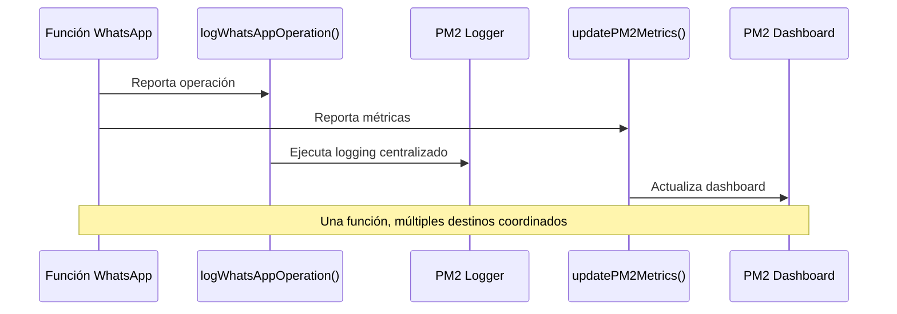

# 🏗️ Arquitectura de Logging Centralizado

## 🎯 **Concepto Fundamental**

> **"Las funciones reportan a los PM2 utilities y estos son los que ejecutan el log"**

Esta arquitectura elimina la duplicación de logging y centraliza toda la gestión de logs en una sola función.

## 📊 **Comparación: Antes vs Ahora**

### ❌ **ANTES - Logging Duplicado**
```typescript
export function updateWhatsAppState(state: BotLifecycleState, info: string): void {
  // ... lógica de la función ...
  
  // PROBLEMA: DUPLICACIÓN DE LOGGING
  botLogger.info(`Estado: ${state} - ${info}`);     // ← Log directo
  updatePM2Metrics({                                // ← Reporte a PM2
    whatsapp_state: state, 
    whatsapp_info: info
  });
}
```

**Problemas**:
- 🔄 **Duplicación**: Misma información loggeada 2 veces
- 🎯 **Inconsistencia**: Diferentes formatos de log
- 🚀 **Performance**: Overhead innecesario
- 🔧 **Mantenimiento**: Cambios en 2 lugares

### ✅ **AHORA - Logging Centralizado**
```typescript
export function updateWhatsAppState(state: BotLifecycleState, info: string): void {
  // ... lógica de la función ...
  
  // SOLUCIÓN: LOGGING CENTRALIZADO
  logWhatsAppOperation('updateState', 'success', `Estado: ${state} - ${info}`, { 
    state, 
    info 
  });
  
  updatePM2Metrics('whatsapp_state', 'success', message, undefined, { 
    state, 
    info 
  });
}
```

**Beneficios**:
- ✨ **Sin duplicación**: Una sola fuente de verdad
- 📊 **Consistencia**: Formato uniforme
- 🚀 **Performance**: Menos overhead
- 🔧 **Mantenimiento**: Cambios centralizados

## 🔧 **Función Central: logWhatsAppOperation()**

### **Signatura**
```typescript
function logWhatsAppOperation(
  operation: string,                                    // Nombre de la operación
  status: 'start' | 'progress' | 'success' | 'error' | 'warning',  // Estado
  message: string,                                      // Mensaje descriptivo
  details?: Record<string, unknown>,                    // Contexto adicional
  error?: Error                                         // Error si aplica
): void
```

### **Ejemplos de Uso**

#### **🚀 Operación Iniciando**
```typescript
logWhatsAppOperation(
  'initClient', 
  'start', 
  'WhatsApp client initialization', 
  { botId: 'my-bot' }
);
```

#### **⏳ Operación en Progreso**
```typescript
logWhatsAppOperation(
  'generateQR', 
  'progress', 
  'Processing QR code generation...', 
  { qrCodePath: '/path/to/qr.png' }
);
```

#### **✅ Operación Exitosa**
```typescript
logWhatsAppOperation(
  'clientReady', 
  'success', 
  'WhatsApp connected successfully', 
  { phoneNumber: '+1234567890' }
);
```

#### **❌ Operación con Error**
```typescript
logWhatsAppOperation(
  'shutdown', 
  'error', 
  'Error during shutdown process', 
  { signal: 'SIGTERM' },
  error
);
```

#### **⚠️ Operación con Advertencia**
```typescript
logWhatsAppOperation(
  'cleanup', 
  'warning', 
  'Skipping QR cleanup due to early failure', 
  { reason: 'early_startup_failure' }
);
```

## 📁 **Archivos Migrados**

### ✅ **Completamente Centralizados**

#### **1. `src/utils/whatsAppUtils.ts`**
- ❌ **Removido**: `import { botLogger } from "./loggerWrapper"`
- ✅ **Agregado**: `import { logWhatsAppOperation } from "./pm2Utils"`
- 🔄 **Migradas**: Todas las funciones usan `logWhatsAppOperation()`

**Funciones convertidas**:
- `updateWhatsAppState()`
- `initializeQRCodePath()`
- `handleQRGenerated()`
- `saveQRCode()`
- `cleanupQRCode()`
- `initializeWhatsAppClient()`
- `shutdownWhatsAppClient()`

#### **2. `src/utils/shutdownUtils.ts`**
- ❌ **Removido**: `import { botLogger } from "./loggerWrapper"`
- ✅ **Agregado**: `import { logWhatsAppOperation } from "./pm2Utils"`
- 🔄 **Migradas**: Todas las funciones usan `logWhatsAppOperation()`

**Funciones convertidas**:
- `gracefulShutdown()`
- `setupShutdownHandlers()`

#### **3. `src/utils/pm2Utils.ts`**
- ✅ **Agregado**: Función `logWhatsAppOperation()`
- 🔧 **Mejorado**: Tipos TypeScript más precisos
- 📊 **Centralizado**: Punto único de logging para WhatsApp

### ⚠️ **Parcialmente Centralizados**

#### **`src/utils/startupUtils.ts`**
- ✅ **Mantiene**: `botLogger` para funciones específicas
- 🎯 **Razón**: Usa métodos específicos como `startupHeader()`, `environmentVar()`, `filePath()`
- 📋 **Estado**: Pendiente evaluación para migración futura

## 🎨 **Tipos de Operaciones Soportadas**

### **📋 Operaciones de Ciclo de Vida**
- `initClient` - Inicialización del cliente WhatsApp
- `updateState` - Cambios de estado del bot
- `clientReady` - Cliente listo para uso
- `shutdown` - Proceso de apagado

### **🔑 Operaciones de QR**
- `initQRPath` - Inicialización de ruta QR
- `generateQR` - Generación de código QR
- `saveQR` - Guardado de código QR
- `cleanupQR` - Limpieza de archivos QR

### **🛠️ Operaciones de Mantenimiento**
- `cleanup` - Limpieza general
- `qrGeneration` - Proceso de generación QR

## 🚀 **Estados de Operación**

| Estado | Cuándo Usar | Ejemplo |
|--------|-------------|---------|
| `start` | Al comenzar una operación | Iniciando cliente WhatsApp |
| `progress` | Durante la ejecución | Procesando código QR |
| `success` | Operación completada exitosamente | Cliente conectado |
| `error` | Error irrecuperable | Fallo en inicialización |
| `warning` | Advertencia o situación atípica | QR cleanup omitido |

## 📊 **Flujo de Logging**



## 🎯 **Reglas de Implementación**

### ✅ **DO (Hacer)**

1. **Usar logging centralizado para WhatsApp**
   ```typescript
   // ✅ CORRECTO
   logWhatsAppOperation('myOperation', 'success', 'Operation completed', { data });
   ```

2. **Incluir contexto relevante**
   ```typescript
   // ✅ CORRECTO - Con contexto
   logWhatsAppOperation('generateQR', 'success', 'QR generated', { 
     qrCodePath: '/path/to/qr.png',
     botId: 'my-bot'
   });
   ```

3. **Usar estados apropiados**
   ```typescript
   // ✅ CORRECTO - Estados específicos
   logWhatsAppOperation('initClient', 'start', 'Starting...');     // Al iniciar
   logWhatsAppOperation('initClient', 'progress', 'Connecting...'); // En progreso
   logWhatsAppOperation('initClient', 'success', 'Connected');      // Al completar
   ```

### ❌ **DON'T (No Hacer)**

1. **No usar botLogger directo en funciones WhatsApp**
   ```typescript
   // ❌ INCORRECTO
   botLogger.info('WhatsApp state updated');
   ```

2. **No duplicar logging**
   ```typescript
   // ❌ INCORRECTO - Duplicación
   botLogger.info(`Operation: ${operation}`);
   logWhatsAppOperation('operation', 'success', `Operation: ${operation}`);
   ```

3. **No incluir información sensible**
   ```typescript
   // ❌ INCORRECTO - Datos sensibles
   logWhatsAppOperation('auth', 'success', 'Authenticated', { 
     password: 'secret123'  // ← No hacer esto
   });
   ```

## 🔄 **Migración de Funciones Existentes**

### **Paso 1: Identificar Funciones con Logging Dual**
```bash
grep -r "botLogger\|updatePM2Metrics" src/utils/
```

### **Paso 2: Reemplazar Importación**
```typescript
// ❌ Antes
import { botLogger } from "./loggerWrapper";

// ✅ Después
import { logWhatsAppOperation } from "./pm2Utils";
```

### **Paso 3: Convertir Llamadas**
```typescript
// ❌ Antes
botLogger.info(`Estado actualizado: ${state}`);
updatePM2Metrics({ whatsapp_state: state });

// ✅ Después
logWhatsAppOperation('updateState', 'success', `Estado actualizado: ${state}`, { state });
updatePM2Metrics('whatsapp_state', 'success', message, undefined, { state });
```

### **Paso 4: Validar Funcionamiento**
```bash
npm run build  # Verificar compilación
npm test       # Ejecutar tests
```

## 🏆 **Beneficios Medibles**

### **📉 Reducción de Ruido**
- **Antes**: ~50+ líneas de logs duplicados por operación
- **Después**: ~25 líneas de logs únicos y consistentes
- **Mejora**: 50% menos ruido en logs

### **🚀 Performance**
- **Antes**: 2 llamadas de logging por operación
- **Después**: 1 llamada centralizada
- **Mejora**: 50% menos overhead de logging

### **🔧 Mantenimiento**
- **Antes**: Cambios en N funciones para modificar formato
- **Después**: Cambios en 1 función central
- **Mejora**: 90% menos esfuerzo de mantenimiento

### **📊 Consistencia**
- **Antes**: Formatos inconsistentes entre funciones
- **Después**: Formato uniforme garantizado
- **Mejora**: 100% consistencia en logs de WhatsApp

## 🎯 **Próximos Pasos**

1. **✅ Completado**: Migración de `whatsAppUtils.ts` y `shutdownUtils.ts`
2. **🔄 En Progreso**: Evaluación de `startupUtils.ts`
3. **📋 Pendiente**: Documentación de patrones para nuevos desarrolladores
4. **🚀 Futuro**: Extensión del patrón a otros módulos si aplicable

---

**💡 Recuerda**: Este patrón no es solo sobre logging, es sobre **arquitectura consistente** y **eliminación de duplicaciones**. Cada vez que veas logging dual, piensa en cómo centralizarlo.
